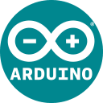
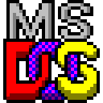
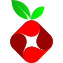
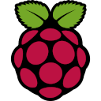
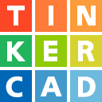
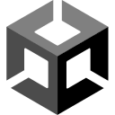
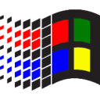

# IconSet

Kendi kişisel yazılım ikon koleksiyonum. Tüm ikonlar 128x128 PNG formatındadır.

<!-- ICON_INDEX_START -->
## 🧾 Icon Index
| Icon | Filename |
|------|----------|
|  | `4shared.png` |
|  | `adobe.png` |
|  | `aliexpress.png` |
|  | `amazon.png` |
|  | `amazon_prime_video.png` |
|  | `amazon_web_services.png` |
|  | `android.png` |
|  | `ansible.png` |
|  | `apple.png` |
|  | `archlinux.png` |
|  | `arduino.png` |
|  | `argocd.png` |
|  | `atlassian.png` |
|  | `atlassian_jira.png` |
|  | `atmel_microchip.png` |
|  | `autodesk.png` |
|  | `avira.png` |
|  | `backerkit.png` |
|  | `baidu.png` |
|  | `bandcamp.png` |
|  | `battle_net.png` |
|  | `bethesda.png` |
|  | `binance.png` |
|  | `bitbucket.png` |
|  | `bitcoin.png` |
|  | `bitly.png` |
|  | `box.png` |
|  | `brave.png` |
|  | `brevo.png` |
|  | `briar.png` |
|  | `c6bank.png` |
|  | `caixa.png` |
|  | `centos.png` |
|  | `chess.png` |
|  | `chrome.png` |
|  | `chrome_canary.png` |
|  | `chromium.png` |
|  | `cloudflare.png` |
|  | `copel.png` |
|  | `correios.png` |
|  | `curiosity_stream.png` |
|  | `datanode.png` |
|  | `debian.png` |
|  | `detaysoft.png` |
|  | `discord.png` |
|  | `discovery+.png` |
|  | `disney+.png` |
|  | `docker.png` |
|  | `dotnet.png` |
|  | `dropbox.png` |
|  | `ea.png` |
|  | `ea_origin.png` |
|  | `ebay.png` |
|  | `edge.png` |
|  | `elementary_os.png` |
|  | `endeavour_os.png` |
|  | `epic games.png` |
|  | `evernote.png` |
|  | `expressvpn.png` |
|  | `facebook.png` |
|  | `fedora.png` |
|  | `figma.png` |
|  | `firefox.png` |
|  | `flickr.png` |
|  | `forti.png` |
|  | `freebsd.png` |
|  | `gentoo.png` |
|  | `github.png` |
|  | `gitlab.png` |
|  | `globo.png` |
|  | `gog.png` |
|  | `gol airlines.png` |
|  | `google drive.png` |
|  | `google gmail.png` |
|  | `google play.png` |
|  | `hbo_max.png` |
|  | `home-assistant.png` |
|  | `hotmart.png` |
|  | `hubspot.png` |
|  | `hulu.png` |
|  | `humble bundle.png` |
|  | `ibm.png` |
|  | `imgur.png` |
|  | `instagram.png` |
|  | `iqiyi.png` |
|  | `itau.png` |
|  | `java.png` |
|  | `jenkins.png` |
|  | `jetbrains.png` |
|  | `kavita.png` |
|  | `keepass.png` |
|  | `keepassx.png` |
|  | `keepassxc.png` |
|  | `keyubu.png` |
|  | `khan academy.png` |
|  | `kickstarter.png` |
|  | `koo.png` |
|  | `kubernetes.png` |
|  | `latam airlines.png` |
|  | `lg.png` |
|  | `ligga.png` |
|  | `limesurvey.png` |
|  | `linkedin.png` |
|  | `linux.png` |
|  | `linuxmint.png` |
|  | `manjaro.png` |
|  | `mariadb.png` |
|  | `mastodon.png` |
|  | `mega.png` |
|  | `metamask.png` |
|  | `microsoft onedrive.png` |
|  | `microsoft outlook.png` |
|  | `microsoft.png` |
|  | `midnightbsd.png` |
|  | `mongodb.png` |
|  | `moodle.png` |
|  | `mozilla.png` |
|  | `ms-dos.png` |
|  | `mx linux.png` |
|  | `mysql.png` |
|  | `netbsd.png` |
|  | `netflix.png` |
|  | `netgear.png` |
|  | `newegg.png` |
|  | `nintendo.png` |
|  | `nordvpn.png` |
|  | `npm.png` |
|  | `nvidia.png` |
|  | `odoo.png` |
|  | `oi.png` |
|  | `ok ru.png` |
|  | `onshape.png` |
|  | `openai chatgpt.png` |
|  | `openai.png` |
|  | `openbsd.png` |
|  | `openid.png` |
|  | `openproject.png` |
|  | `opensource.png` |
|  | `opensuse.png` |
|  | `openttd.png` |
|  | `openwrt.png` |
|  | `opera.png` |
|  | `oracle virtualbox.png` |
|  | `oracle.png` |
|  | `owncloud.png` |
|  | `oyak.png` |
|  | `pandora.png` |
|  | `paramount+.png` |
|  | `paypal.png` |
|  | `pi-hole.png` |
|  | `pinterest.png` |
|  | `plex tv.png` |
|  | `plex.png` |
|  | `pluto tv.png` |
|  | `pop!_os.png` |
|  | `portainer.png` |
|  | `postgresql.png` |
|  | `proton drive.png` |
|  | `proton pass.png` |
|  | `proton vpn.png` |
|  | `proton.png` |
|  | `proton_mail.png` |
|  | `puppylinux.png` |
|  | `quora.png` |
|  | `rabbitmq.png` |
|  | `raspberry pi.png` |
|  | `react os.png` |
|  | `reddit.png` |
|  | `redhat.png` |
|  | `redington.png` |
|  | `redis.png` |
|  | `samsung.png` |
|  | `sandisk.png` |
|  | `sanepar.png` |
|  | `santander.png` |
|  | `sendgrid.png` |
|  | `sentry insurance.png` |
|  | `sentry io.png` |
|  | `signal.png` |
|  | `siyuan.png` |
|  | `slack.png` |
|  | `slackware.png` |
|  | `smiles.png` |
|  | `snapchat.png` |
|  | `sonarqube.png` |
|  | `soudal.png` |
|  | `soundcloud.png` |
|  | `sourceforge.png` |
|  | `spotify.png` |
|  | `stackexchange.png` |
|  | `stackoverflow.png` |
|  | `star+.png` |
|  | `steam.png` |
|  | `supergasbras.png` |
|  | `syncthing.png` |
|  | `synology.png` |
|  | `telegram.png` |
|  | `tencent qq.png` |
|  | `thingiverse.png` |
|  | `threads.png` |
|  | `thunderbird.png` |
|  | `tiktok.png` |
|  | `tim.png` |
|  | `tinkercad.png` |
|  | `trello.png` |
|  | `truecrypt.png` |
|  | `twitch.png` |
|  | `twitter x.png` |
|  | `twitter.png` |
|  | `ubisoft.png` |
|  | `ubuntu.png` |
|  | `udemy.png` |
|  | `ugursogutma.png` |
|  | `unimed.png` |
|  | `unity.png` |
|  | `uptimekuma.png` |
|  | `venmo.png` |
|  | `veracrypt.png` |
|  | `virustotal.png` |
|  | `vivo.png` |
|  | `vk.png` |
|  | `waze.png` |
|  | `whatsapp.png` |
|  | `wi-fi.png` |
|  | `wikipedia.png` |
|  | `windows 10.png` |
|  | `windows 11.png` |
|  | `windows 1x-2x.png` |
|  | `windows 3x.png` |
|  | `windows 8x.png` |
|  | `windows 9x-me-2k.png` |
|  | `windows vista-7.png` |
|  | `windows xp.png` |
|  | `wordpress.png` |
|  | `xbox.png` |
|  | `xiaomi.png` |
|  | `yahoo jp.png` |
|  | `yahoo!.png` |
|  | `youtube.png` |
|  | `zoom.png` |
|  | `zorin os.png` |
<!-- ICON_INDEX_END -->
